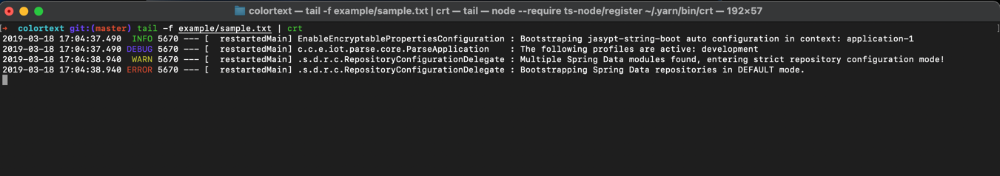

# colortext

color text

## Usage

```shell
yarn global add colortext
```

```shell
tail -f example/sample.txt | crt
```



## Config

default config file `~/.crt/config.yaml`

```yaml
rules:
  - regex: "(error|Error|ERROR)"
    color: red
  - regex: "(warn|Warn|WARN)"
    color: yellow
  - regex: "(info|Info|INFO)"
    color: green
  - regex: "(debug|Debug|DEBUG)"
    color: blue
color:
  
```

color list

    black, red, green, yellow, blue, magenta, cyan, gray

## Doc

- [Terminal Colors](https://chrisyeh96.github.io/2020/03/28/terminal-colors.html)
